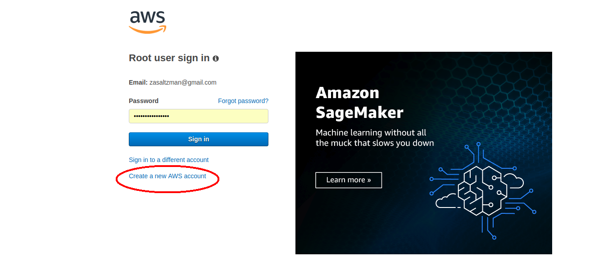
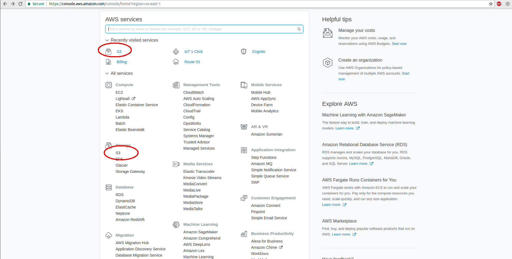

# Creating a New AWS Bucket

BioImageSuite Web is capable of reading files from a user's AWS Buckets, but configuring this properly requires a bit of setup. This document will explain the most efficient way to create an Amazon AWS account, set up your bucket, and configure it to work with BisWeb.

### Creating an AWS Account 

The first step to creating a bucket is to create an Amazon AWS account at [the following link](https://aws.amazon.com/console/). Click the 'Sign In to the Console' button at the top right then click 'Create a new AWS account' just below the blue 'Sign in' button. This will begin a tutorial that will guide you through the process of creating a new AWS Account. Bear in mind that this may require linking a credit card, though what BioImageSuite requires shouldn't exceed the free usage limits.

_Figure 1: The two screens you will see on your way to creating an AWS Account_

### Creating an S3 Bucket

Once you've created an AWS account, find S3 on the console's dashboard and click the link. 

_Figure 2: The AWS Console with the S3 button highlighted._

Once in the main S3 menu, click the 'Create bucket' button and follow the prompts to configure your bucket. Note that BioImageSuite does not currently support encrypted buckets, but this may change in a future release. 

_Figure 3: The 'Create Bucket' button and the prompt it will open._

Once the bucket is created you will need to set two properties to allow it to work BioImageSuite: the Bucket Policy and the CORS configuration.

### Bucket Policy

The bucket needs to be associated with the BioImageSuite application in order to be accessible from the web browser. This is done using [Amazon Cognito Identity Pools](https://docs.aws.amazon.com/cognito/latest/developerguide/cognito-user-identity-pools.html) to provide security and a unified authentication framework. 

We will have to create an Identity Pool associated with BioImageSuite for you. Once this is done, add the following lines to your bucket's Bucket Policy: 

    {
        "Version": "2012-10-17",
        "Statement": [
            {
                "Effect": "Allow",
                "Principal": {
                    "AWS": "arn:aws:iam::<ACCOUNT_ID>:role/<COGNITO_IDENTITY_POOL_AUTH_ROLE>"
                },
                "Action": "s3:ListBucket",
                "Resource": "arn:aws:s3:::<S3_BUCKET_NAME>"
            },
            {
                "Effect": "Allow",
                "Principal": {
                    "AWS": "arn:aws:iam::<ACCOUNT_ID>:role/<COGNITO_IDENTITY_POOL_AUTH_ROLE>"
                },
                "Action": [
                    "s3:GetObject",
                    "s3:PutObject",
                    "s3:DeleteObject"
                ],
                "Resource": "arn:aws:s3:::<S3_BUCKET_NAME>/*"
            }
        ]
    }

The parts of the policy surrounded by carats will need to be replaced by values relevant to your bucket and values specific to the BioImageSuite User Pools that cannot be published here. 

_Figure 4: The bucket policy screen found under Permissions->Bucket Policy, with the Bucket Policy button and policy editor screen outlined in red. Note that the editor itself is blurred to hide certain information_

